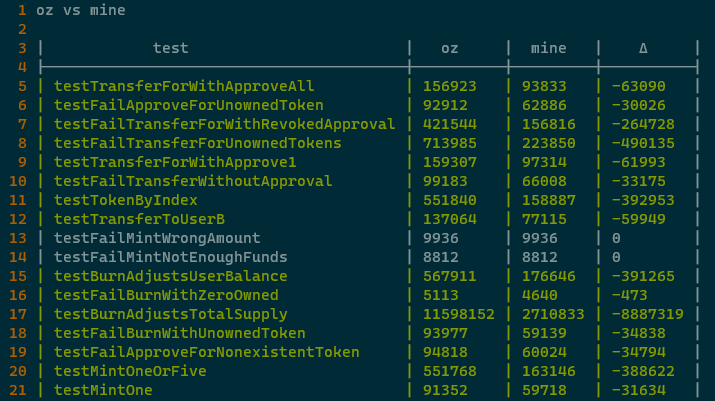
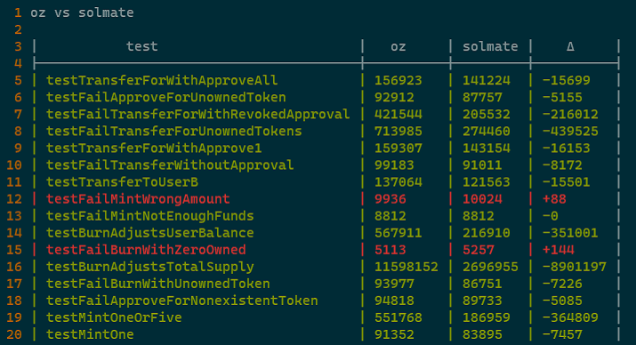
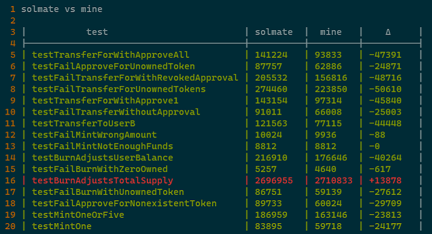

# nfts-contracts

basic implementation of an ERC721 token.

built with [dapp tools](https://dapp.tools).

## getting started

install dapp tools [here](https://github.com/dapphub/dapptools#installation). (Linux or WSL on Windows works best, there may be an issue with some Macbooks and the Nix dependency).

from the root directory run:

  - `dapp build` to compile the contracts
  - `dapp test` to run the tests

## main contracts

| name           | description                    |
|----------------|--------------------------------|
| ERC721.sol     | nft base smart contract        |
| Alphabet.sol   | your nft contract              |
| Alphabet.t.sol | test file, written in solidity |

## gas differences

a look at gas cost differences among Open Zeppelin, Solmate, and my optimizations.

